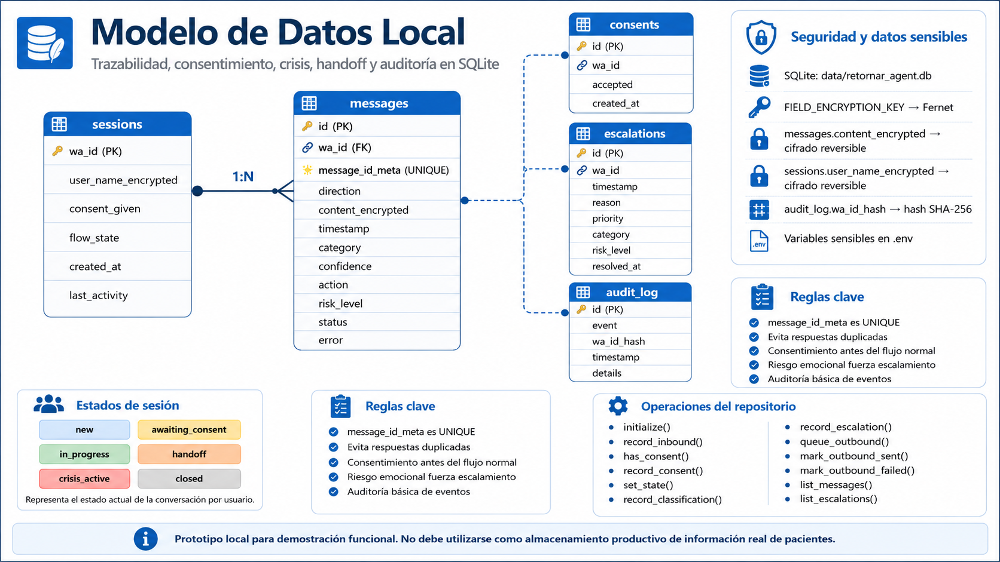

# Modelo De Datos Local

## 1. Objetivo

El modelo de datos soporta la demostracion funcional del agente:

- Trazabilidad de los mensajes recibidos y enviados.
- Control del consentimiento del usuario.
- Registro de crisis y handoffs.
- Auditoria basica de operaciones relevantes.
- Proteccion del contenido sensible guardado localmente.

Almacenamiento implementado:

```text
SQLite: data/retornar_agent.db
```

El archivo y sus journals (`-wal`, `-shm`) estan excluidos de Git.

## 2. Diagrama Entidad-Relacion



`sessions` y `messages` tienen relacion declarada por clave foranea. Las
tablas `consents`, `escalations` y `audit_log` mantienen el identificador para
consultas y auditoria del prototipo.

## 3. Tabla `sessions`

Representa el estado actual de la conversacion por usuario.

| Campo | Tipo | Uso |
|---|---|---|
| `wa_id` | `TEXT PRIMARY KEY` | Identificador del chat o numero de WhatsApp. |
| `user_name_encrypted` | `BLOB` | Nombre cifrado con Fernet, si llega desde el canal. |
| `consent_given` | `INTEGER` | `1` si el usuario autorizo; `0` por defecto. |
| `flow_state` | `TEXT` | Estado actual del flujo conversacional. |
| `created_at` | `TEXT` | Fecha ISO de creacion de sesion. |
| `last_activity` | `TEXT` | Fecha ISO del ultimo mensaje recibido. |

Estados manejados:

| Estado | Significado |
|---|---|
| `new` | Sesion creada, sin procesamiento previo. |
| `awaiting_consent` | Bot pidio autorizacion y espera respuesta. |
| `in_progress` | Atencion automatizada habilitada. |
| `handoff` | El caso debe ser atendido por humano. |
| `crisis_active` | Se detecto riesgo y se genero escalamiento critico. |
| `closed` | Usuario rechazo consentimiento o flujo cerrado. |

## 4. Tabla `messages`

Registra mensajes entrantes y salientes.

| Campo | Tipo | Uso |
|---|---|---|
| `id` | `TEXT PRIMARY KEY` | UUID local de registro. |
| `wa_id` | `TEXT NOT NULL` | Referencia a la sesion. |
| `message_id_meta` | `TEXT UNIQUE` | ID externo de Meta/Baileys o respuesta enviada. |
| `direction` | `TEXT` | `inbound` o `outbound`. |
| `content_encrypted` | `BLOB` | Texto cifrado con Fernet. |
| `timestamp` | `TEXT` | Momento de recepcion/envio en formato ISO. |
| `category` | `TEXT` | Categoria determinada para el mensaje entrante. |
| `confidence` | `REAL` | Confianza del clasificador. |
| `action` | `TEXT` | Accion sugerida o forzada. |
| `risk_level` | `TEXT` | Nivel de riesgo identificado. |
| `status` | `TEXT` | Estado tecnico del mensaje. |
| `error` | `TEXT` | Error de envio si ocurre. |

Estados salientes utilizados:

| Estado | Descripcion |
|---|---|
| `queued` | Respuesta guardada antes de enviarse. |
| `sent` | Adaptador confirmo el envio o simulacion local. |
| `failed` | El adaptador no pudo enviar. |

Regla de idempotencia:

```text
message_id_meta es UNIQUE
```

Si WhatsApp o el bridge reentrega el mismo mensaje, `record_inbound()` retorna
que ya existia y el servicio no genera una respuesta duplicada.

## 5. Tabla `consents`

Conserva evidencia de las respuestas a la solicitud de autorizacion.

| Campo | Tipo | Uso |
|---|---|---|
| `id` | `TEXT PRIMARY KEY` | UUID del evento de consentimiento. |
| `wa_id` | `TEXT` | Usuario asociado. |
| `accepted` | `INTEGER` | `1` acepto; `0` rechazo. |
| `created_at` | `TEXT` | Fecha de registro. |

Al mismo tiempo se actualiza `sessions.consent_given` para decisiones rapidas
durante la conversacion.

## 6. Tabla `appointment_requests`

Conserva el avance de una solicitud de cita mientras se recolectan los slots
definidos para la demo local.

| Campo | Tipo | Uso |
|---|---|---|
| `wa_id` | `TEXT PRIMARY KEY` | Conversacion asociada. |
| `tipo_cita_encrypted` | `BLOB` | Control, primera vez o reprogramacion, cifrado. |
| `especialidad_encrypted` | `BLOB` | Especialidad solicitada, cifrada. |
| `eps_encrypted` | `BLOB` | EPS informada por el usuario, cifrada. |
| `urgencia_encrypted` | `BLOB` | Urgente o no urgente, cifrado. |
| `status` | `TEXT` | `collecting` o `requested`. |
| `created_at`, `updated_at` | `TEXT` | Trazabilidad temporal. |

Cuando estan completos `tipo_cita`, `especialidad`, `eps` y `urgencia`, el
bot confirma que registro la solicitud; no afirma que una cita ya fue asignada.

## 7. Tabla `escalations`

Registra casos derivados a atencion humana.

| Campo | Tipo | Uso |
|---|---|---|
| `id` | `TEXT PRIMARY KEY` | UUID del escalamiento. |
| `wa_id` | `TEXT` | Usuario/chat involucrado. |
| `timestamp` | `TEXT` | Fecha de creacion. |
| `reason` | `TEXT` | Motivo: riesgo o accion del clasificador. |
| `priority` | `TEXT` | `normal`, `urgent` o `critical`. |
| `category` | `TEXT` | Categoria del mensaje que origino el caso. |
| `risk_level` | `TEXT` | Nivel de riesgo identificado. |
| `resolved_at` | `TEXT` | Reservado para cierre futuro del caso. |

Ejemplos:

| Mensaje | Categoria | Prioridad |
|---|---|---|
| "Me quiero matar, tengo las pastillas" | `consulta_clinica` | `critical` |
| "Olvide tomar la sertralina" | `consulta_clinica` | `urgent` |
| "Quiero poner una queja" | `pqr` | `normal` |

## 8. Tabla `audit_log`

Guarda eventos del sistema sin registrar el identificador directo en la
columna de auditoria.

| Campo | Tipo | Uso |
|---|---|---|
| `id` | `TEXT PRIMARY KEY` | UUID del evento. |
| `event` | `TEXT` | Tipo de operacion auditada. |
| `wa_id_hash` | `TEXT` | SHA-256 del identificador de usuario. |
| `timestamp` | `TEXT` | Fecha del evento. |
| `details` | `TEXT` | JSON con metadatos de la operacion. |

Eventos implementados:

| Evento | Momento |
|---|---|
| `consent_recorded` | Usuario acepta o rechaza consentimiento. |
| `state_changed` | Sesion cambia de estado. |
| `appointment_updated` | Solicitud de cita recopila datos o queda registrada. |
| `escalation_created` | Se deriva un caso a atencion humana. |

## 9. Cifrado Y Datos Sensibles

El adaptador SQLite usa `FieldCipher`, basado en Fernet:

```text
FIELD_ENCRYPTION_KEY -> Fernet -> content_encrypted / user_name_encrypted
```

Campos protegidos:

| Campo | Proteccion |
|---|---|
| `messages.content_encrypted` | Cifrado reversible necesario para consultar demo. |
| `sessions.user_name_encrypted` | Cifrado reversible. |
| `appointment_requests.*_encrypted` | Slots de cita cifrados en reposo. |
| `audit_log.wa_id_hash` | Hash SHA-256 para correlacion de auditoria. |

Variables sensibles excluidas del repositorio:

| Dato | Ubicacion local |
|---|---|
| Clave Fernet | `.env` |
| Token/App Secret Meta, si se usa | `.env` |
| Base con conversaciones | `data/*.db*` |
| Sesion de WhatsApp QR | `wa_bridge/auth_info/` |

## 10. Operaciones Del Repositorio

El puerto `ConversationRepository` permite que la aplicacion invoque estas
operaciones:

| Operacion | Efecto |
|---|---|
| `initialize()` | Crea base/tablas si no existen. |
| `record_inbound()` | Registra mensaje entrante y verifica duplicados. |
| `has_consent()` | Consulta si puede continuar el flujo automatizado. |
| `record_consent()` | Guarda decision de autorizacion. |
| `set_state()` | Cambia estado conversacional y audita. |
| `get_open_appointment()` | Recupera los datos aun incompletos de cita. |
| `save_appointment()` | Guarda slots cifrados y estado de solicitud. |
| `record_classification()` | Asocia clasificacion al mensaje recibido. |
| `record_escalation()` | Inserta handoff/crisis y audita. |
| `queue_outbound()` | Persiste la respuesta antes de envio. |
| `mark_outbound_sent()` | Marca respuesta enviada. |
| `mark_outbound_failed()` | Conserva evidencia del fallo. |
| `list_messages()` | Permite observar la conversacion en desarrollo. |
| `list_escalations()` | Permite mostrar handoffs en la demo. |

## 11. Diferencias Frente Al Modelo Productivo

El diseno institucional descrito plantea capacidades adicionales:

| Necesidad productiva | Prototipo local |
|---|---|
| Base administrada, backup y politicas de retencion operativas | SQLite local para evidencia de demo. |
| Control de acceso por roles para personal clinico | No implementado. |
| Handoff gestionado por equipo humano | Solo se registra la derivacion. |
| Integracion con sistemas clinicos | No implementada. |
| Panel de auditoria / dashboard | Consultas locales de desarrollo. |
| WhatsApp API oficial | Disponible como adaptador opcional; demo usa QR. |

El modelo local demuestra la estructura de datos y las reglas principales,
pero no debe utilizarse para almacenar informacion real de pacientes en una
operacion productiva.
